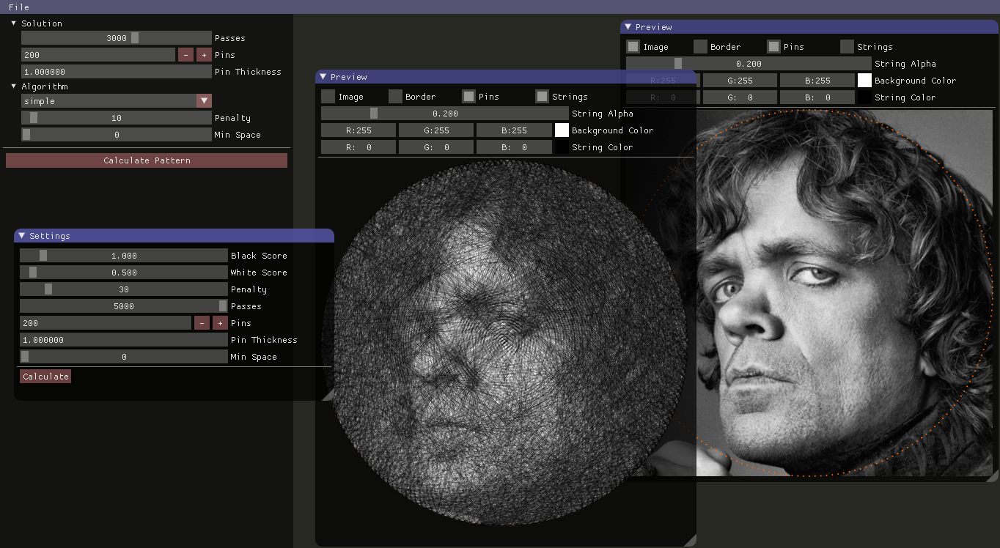
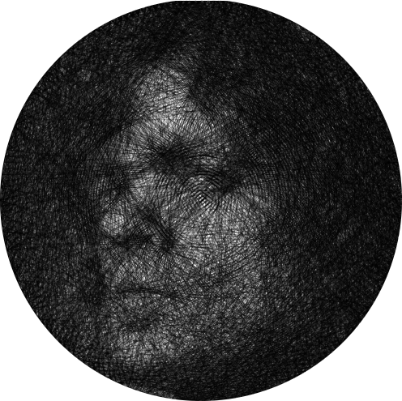

# Strixel

Strixel will convert a grayscale image to a knitting pattern. It is
inspired by the amazing work done by
[Petros Vrellis](http://artof01.com/vrellis/). Checkout his projects
and take a look at [this video](https://vimeo.com/175653201) to get an
idea what this software tries to reproduce and accomblish.

## Current State
:warning: very early stage / messy code





## Usage

Works only with square images at the moment.

```shell
% ./strixel image.png
```

## Todo

- [ ] save/load pattern
- [ ] step throu, play, pause, resume pattern
- [ ] use more than one thread and display progress
- [ ] use text2speech to communicate next pin ([festival](http://www.cstr.ed.ac.uk/projects/festival/), [espeak](http://espeak.sourceforge.net/), ...)
- [ ] knit first real pattern and verify that the preview is representative
- [ ] take pin thickness into account
- [ ] take thread thickness into account (subpixel line)
- [ ] decide how much darker the pixel is depending on the parts of the pixel already covered by threads

## Hacking

```shell
% git clone --recursive -j4 https://github.com/wose/Strixel.git
% cd Strixel
% mkdir build && cd build
% cmake -DCMAKE_BUILD_TYPE=Debug -DCMAKE_EXPORT_COMPILE_COMMANDS=1 ..
```

## Ideas

### Genetic Algorithm

- [ ] see if there are genes which can be muteted

### Multi Frame

By combining two images it should be possible to generate 2 webs
within different frames which produce each image in different
rotations to each other. It might also be possible to add a third
frame with white thread between those two to cancel some of the parts
of the bottom frame depending on its rotation.
